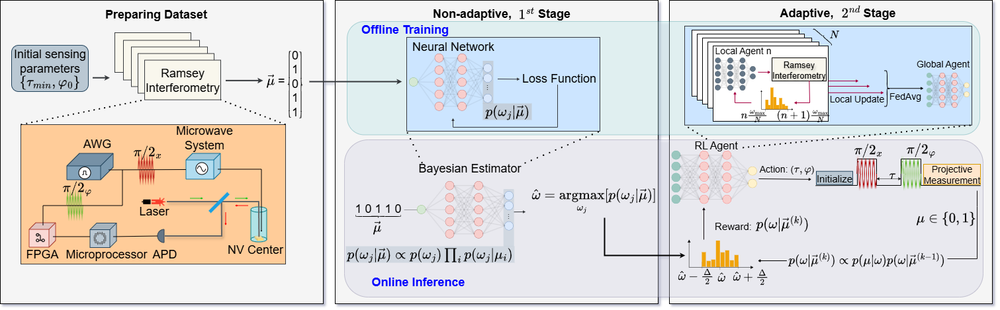
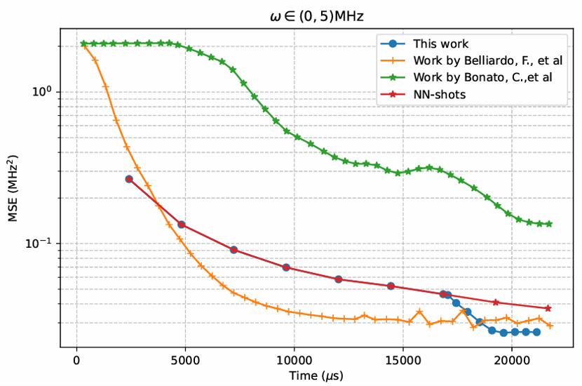
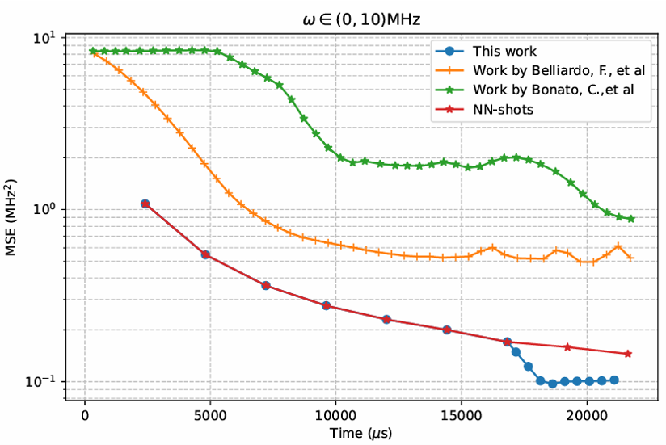
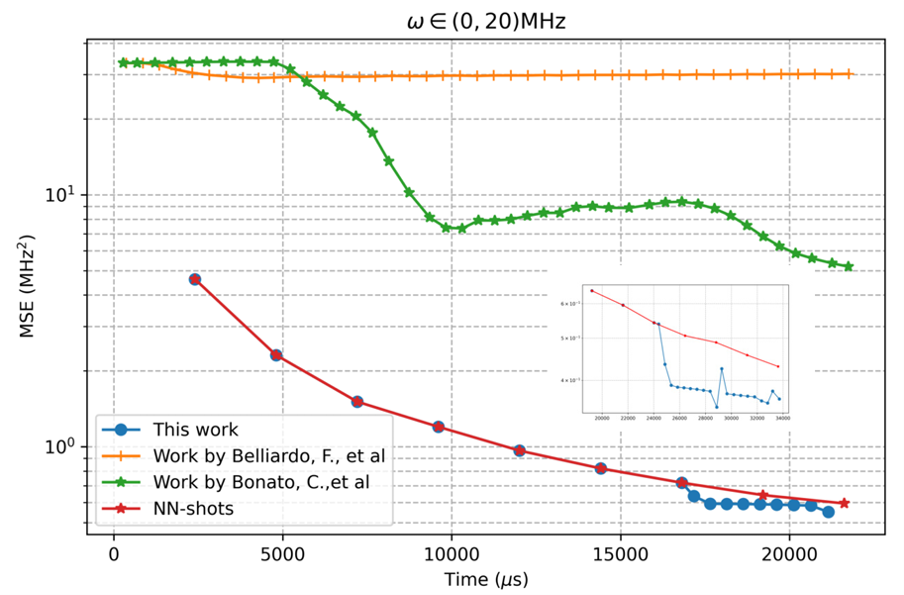

# A Two-stage Optimization Method for Wide-range Single-electron Quantum Magnetic Sensing

This repository contains the implementation of the paper:

> **A Two-stage Optimization Method for Wide-range Single-electron Quantum Magnetic Sensing**  
> Shiqian Guo, Jianqing Liu, Thinh Le, Huaiyu Dai  
> North Carolina State University  

---

## 🔬 Overview

Quantum magnetic sensing using NV centers enables ultra-sensitive detection of weak magnetic fields.  
However, wide-range magnetic field estimation under limited sensing time remains a fundamental challenge.

This work proposes a **two-stage progressive optimization framework**:

### Stage 1: Bayesian Neural Network (BNN)
- Fixed sensing parameters  
- Performs coarse estimation over a wide magnetic field range  
- Outputs estimated value and uncertainty

### Stage 2: Federated Reinforcement Learning (Fed-RL)
- Narrows search to a subrange  
- Optimizes sensing time (τ) and control phase (φ) adaptively  
- Aggregates multiple local RL agents using FedAvg  
- Improves estimation accuracy under limited time budget

---

## 📊 Framework

<p align="center">
  
</p>

<p align="center">
  <em>Two-stage optimization framework combining BNN estimation and federated reinforcement learning</em>
</p>

---

## 📈 Performance Comparison

<p align="center">
  
  
  
</p>

<p align="center">
  <b>Left:</b> ω ∈ (0,5) MHz &nbsp;&nbsp;
  <b>Middle:</b> ω ∈ (0,10) MHz &nbsp;&nbsp;
  <b>Right:</b> ω ∈ (0,20) MHz
</p>

The proposed method achieves:

- 30.2% improvement over NN-shots (ω ∈ (0,5) MHz)
- 29.5% improvement over NN-shots (ω ∈ (0,10) MHz)
- 7.5% improvement in wide-range ω ∈ (0,20) MHz

Under a strict sensing time budget of 22,000 μs.

---

## 🧠 Key Innovations

- Decouples wide-range estimation and fine-grained optimization
- Overcomes RL convergence issues in large search spaces
- Introduces federated learning to improve policy generalization
- Sensor-agnostic framework extendable beyond NV centers

---

## ⚙️ Implementation Details

### BNN Estimator
- Fully connected network
- 2 hidden layers (32 neurons each)
- Softmax output over discretized magnetic field
- Trained with cross-entropy loss

### Federated RL Agent
- 5-layer neural network
- 64 neurons per layer
- FedAvg aggregation
- Particle filter posterior approximation

---

## 🧪 Experimental Setup

- Single NV-center with single-shot readout
- Coherence time T2 = 96 μs
- Total sensing time budget = 22,000 μs
- Overhead per Ramsey shot = 240 μs

---

## 🔗 Code Access

The full implementation of this work is currently hosted externally.

📂 **Google Drive Repository:**  
https://drive.google.com/drive/folders/1iSDuGiVmIrKn63gPpXm7lIwqXYvPTQKp?usp=drive_link

⚠️ Note: The code is provided for research purposes. Please contact the authors for collaboration or clarification.

---

## ▶️ Running the Code

### Train Federated RL Agent for the proposed federated reinforcement learning algorithm

``` 
python Quantum Sensing-code\Federated RL-training\Train-RL-Federal\examples\nv_center_dc_phase.py
```

### To compare with the other methods by change folder name: Train-RL -noDiv / Train-RL-pow 

```
python Quantum Sensing-code\Federated RL-training\folder name\examples\nv_center_dc_phase.py
```

### To train the multipleM/oneM RL agents by change folder name: Train-RL -IND / Train-RL-noF

```
python Quantum Sensing-code\Federated RL-training\folder name\examples\nv_center_dc_phase.py
```

### Bayesian NN estimator

#### To build the training dataset
```
python Quantum Sensing-code\Federated RL-training\queso-main\queso\sample\circuit.py
```

#### To train the BNN

```
python Quantum Sensing-code\Federated RL-training\queso-main\queso\train\train_nn.py
```

### Evaluate the proposed federated RL agent and oneM-RL agent

```
python Quantum Sensing-code\Federated RL-testing\Test-qsensoropt-master - nnRL\examples\nv_center_dc_phase.py
```

### Evaluate multipleM-RL agent

```
python Quantum Sensing-code\Federated RL-testing\Test-qsensoropt-master -IND\examples\nv_center_dc_phase.py
```

---

## 📖 Citation

If you use this work, please cite:

```
@article{guo2025two,
  title={A Two-stage Optimization Method for Wide-range Single-electron Quantum Magnetic Sensing},
  author={Guo, Shiqian and Liu, Jianqing and Le, Thinh and Dai, Huaiyu},
  journal={arXiv preprint arXiv:2506.13469},
  year={2025}
}
```

---

## 📬 Contact

For collaboration inquiries:

📧 sguo26@ncsu.edu  
📧 jliu96@ncsu.edu
